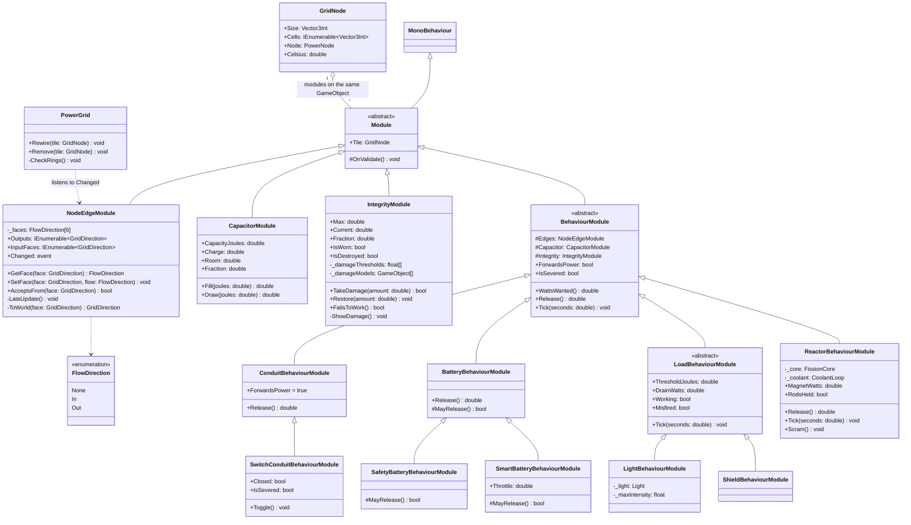

# Modules

**Status: design, not built** (2026-09-26). Replaces the one-script-per-thing layer in `scripts/Ship/`.

A conduit and a component are the same kind of thing. Both take power in, hold it, do something
with it, and put power out. What differs is the *something*. So every tile on the grid is a
`GridNode` plus a stack of **modules**. A module is a script you add to the GameObject to give it a
feature or a behaviour.

## The four kinds

| Kind | Concrete | Owns | How many per tile |
|---|---|---|---|
| `NodeEdgeModule` | — | which faces power enters and leaves by, kept live as the ship changes | exactly one |
| `CapacitorModule` | — | how much the tile can hold, and how much it holds now | at most one |
| `IntegrityModule` | — | condition, wear, misfires, and which model shows the damage | at most one, optional |
| `BehaviourModule` | `ConduitBehaviourModule`, `BatteryBehaviourModule`, `ReactorBehaviourModule`, … | what the tile *does* with its hold, and how much it lets go of | exactly one |

**Only the behaviour knows what the tile is.** The edges, the capacitor and integrity know nothing
about batteries or reactors. The behaviour decides how they interact, or whether they interact at all.

## Examples

What you would see in the Inspector.

```
Conduit                     Switch                      Tee
  GridNode                    GridNode                    GridNode
  NodeEdgeModule              NodeEdgeModule              NodeEdgeModule
    -X In                       -X In                       -X In
    +X Out                      +X Out                      +X Out
                                                            -Z Out       <- the whole splitter
  CapacitorModule (tiny)      CapacitorModule (tiny)      CapacitorModule (tiny)
  ConduitBehaviourModule      SwitchConduitBehaviour-     ConduitBehaviourModule
  Conduit (visual)              Module                    Conduit (visual)
                              Conduit (visual)

Battery                     Light                       Shield (not built)
  GridNode                    GridNode                    GridNode
  NodeEdgeModule              NodeEdgeModule              NodeEdgeModule
    -X In                       -X In                       -X In
    +X Out
  CapacitorModule             CapacitorModule             CapacitorModule
  IntegrityModule             IntegrityModule             IntegrityModule
  SmartBatteryBehaviour-      LightBehaviourModule        ShieldBehaviourModule
    Module

Reactor
  GridNode (3x3x3)
  NodeEdgeModule
    -Z In                   <- starter / control socket
    +X Out
  CapacitorModule (small)   <- the core fills it, the magnets and the output drain it
  IntegrityModule
  ReactorBehaviourModule
```

Faces not listed are `None`. A **splitter stops being a module of its own.** A branch is one more
`Out` face. The share rule
does the rest, as it already does.

## Class diagram



`#` is protected. `LoadBehaviourModule` is today's `Accumulator`, the relaxation oscillator. A
light, a shield, a radar and a gun are that same cycle with different numbers and a different
thing to switch on.

### What each behaviour does

| Behaviour | `ForwardsPower` | `WattsWanted` | `Release` | `Tick` |
|---|---|---|---|---|
| Conduit | **yes** | room in the hold | the whole hold | nothing |
| Switch conduit | yes | nothing while open | nothing while open | nothing |
| Battery | no | room, up to charge rate | discharge rate, if `MayRelease` | nothing |
| Safety / Smart | no | as battery | `MayRelease` asks for a consumer / for demand × throttle | nothing |
| Load | no | room, up to draw rate | — (no output) | charge to threshold, work while draining, misfire if worn |
| Reactor | no | room, while the core is not covering the magnets | the hold **minus one tick of magnet draw** | core fills the hold, magnets drain it, rods drop if they go short |

The reactor row is the old house-load code, now expressed as a reservation on a shared hold. A
running core covers its own magnets because the magnets draw from the same capacitor the core fills.
A cold core fills that capacitor through its input from a starter battery instead. It's one path,
not two, and the `PassesThrough` flag and the casing diode go away.

## One tick

The grid's rules stay the same. What changes is where power sits between steps.

1. **Offer.** Every tile's behaviour decides what it `Release`s from its hold. The graph splits that
   across the live output edges by `Share`, as now. With no live edge, nothing leaves and the power
   stays in the hold.
2. **Travel.** One tile per tick, as now.
3. **Accept.** Each tile takes up to its behaviour's `WattsWanted` into the hold. **What does not fit
   is dumped here, as heat.** That is today's dead-end rule, moved into the inputs.
4. **Behave.** Each behaviour's `Tick`.
5. **Heat, conduction, pop rolls.** Unchanged, per tile.

Power only ever moves between holds or is counted as waste, so it conserves by construction
(principle 11).

**A component never passes power through.** Its inputs fill its hold, and its outputs drain the hold
only as far as its behaviour allows. Only a conduit's behaviour releases the whole hold, so only
conduits are links in the chain:

```
R-c-c-c        the shield has no output. Not a loop, never was.
      |
      S

R-C-C-B-C      the reactor and the battery each break it. Not a loop.
|       |
C-C-C-C-C

A1 -> A2 -> B1 -> B2 -> A1      every tile forwards. A ring.
```

**A ring pops its merge point instantly.** A ring is a cycle made only of tiles whose behaviour
`ForwardsPower`. Its merge point is the tile on the ring fed from outside it (A1 above). The check
runs whenever the wiring changes, not every tick. On the first tick power reaches the merge point,
it takes its full integrity as damage, or severs if it has no `IntegrityModule`.

## Faces

Every face of a tile is `In`, `Out` or `None`, set with `SetFace` and read with `GetFace`. A face is
never both. Storage is one `FlowDirection` per face (`_faces[6]`, indexed by `GridDirection`), so
the inputs and outputs are one list and cannot disagree. A plain enum array survives the Somnium
bundle export, where an array of custom classes arrives empty.

**No more "empty means any".** Today a tile with no inputs declared accepts from every side. With a
value per face, a neighbour takes power only on a face it has set to `In`, so a conduit that accepts
from anywhere has `In` on every face that is not an `Out`. It says what it means.

## Rewiring live — after the MVP

**Not part of the MVP.** The MVP is the current scene in VR, with its wiring fixed and its parts
interactable. Changing the wiring by hand comes after that. This section records what that step
will need.

The crew physically reconfigures the ship, so the wiring cannot be something built once in
`PowerGrid.Awake`, which is all it is today. Three things have to change.

**Faces are local to the tile.** Today a `GridDirection` is a world axis, and rotating a tile does
not rotate its flow. `NodeEdgeModule` stores faces in the tile's own frame and turns them into world
faces through its rotation, so turning a battery round turns its output with it.

**A tile says when it has changed.** `NodeEdgeModule` raises `Changed` when:
- a face is changed (Inspector or `SetFace`)
- the tile moves or turns (`transform.hasChanged`, checked in `LateUpdate`)
- the tile is enabled, disabled or destroyed

It runs in edit mode as well, so the stubs and the gizmos follow along as you build, which is what
`Conduit` being `[ExecuteAlways]` already does for the look.

**The grid rewires one tile, not the ship.** On `Changed`, `PowerGrid.Rewire(tile)` drops every edge
into and out of that tile and reconnects it from its current faces, against its current neighbours
and its old ones, since a tile moving away changes theirs too. Then the ring check runs. That needs
two things `PowerGraph` does not have: `Disconnect(edge)` and `RemoveNode(node)`. Heat, charge and
integrity belong to the tile, not to its edges, so they survive a rewire.

An edge carries one tick's flow at most, so dropping one mid-flight loses at most one tick of power.
It is counted as waste on the sending tile, so the books still balance.

## Deliberate changes from today

- A full battery mid-run dumps what arrives as heat on itself. Today it passes it on.
- Everything downstream of a battery gets at most the battery's discharge rate. It is a real UPS.
- A ring of conduits pops its merge point. Today it quietly compounds (open question 1, closed).
- `PowerNode.PassesThrough` is deleted. What gets through a tile is its behaviour's business.
- `Validate()`'s cycle warning becomes the ring check.

Everything else must come out of the rebuild with the **same numbers** as `power.md`. That is what
the recovered test harness is for.

## Renames

| Now | Becomes |
|---|---|
| `ConduitModule` (abstract, switch + splitter) | gone |
| `SplitterModule` | one more `Out` face on `NodeEdgeModule` |
| `SwitchModule` | `SwitchConduitBehaviourModule` |
| `BatteryModule` + `CellTier` | `NodeEdgeModule` + `CapacitorModule` + `BatteryBehaviourModule` / `Safety…` / `Smart…` |
| `LightModule`, `AccumulatorModule` | `NodeEdgeModule` + `CapacitorModule` + `LightBehaviourModule` / a `LoadBehaviourModule` |
| `ReactorModule` | the reactor stack above; `FissionCore` and `CoolantLoop` stay as they are |
| `ConstantSourceModule` | `ConstantSourceBehaviourModule` (a test source: fills its hold from nothing) |
| `Durability` | `IntegrityModule` |
| `GridNode._outputs` / `_inputs`, `Outputs`, `InputFaces`, `AcceptsFrom` | `NodeEdgeModule._faces`, one `FlowDirection` per face |
| `Conduit` | unchanged. It is the cable's look, not a module |

Five prefabs and the scene need re-stacking. The scene is untracked (see `README.md` → Repo), so it
is done with an `eval` script against the Editor, not by hand.

## Two things that are not obvious

**The maths still lives in plain C#.** Each module holds a small sim object (`CapacitorModule` holds
a `Capacitor`, and so on), the way `BatteryModule` holds an `EnergyStore` today. `PowerGraph` only
ever sees the sim objects. That is the only reason the tests run outside the Editor.

**`IntegrityModule`'s damage list is two plain arrays, not an array of pairs.** Arrays of custom
`[Serializable]` classes arrive **empty** from a Somnium bundle export, while plain arrays survive
(Project Garden lost uploads to this before it was understood). So the list is
`float[] _damageThresholds` beside `GameObject[] _damageModels`, same length. Below each threshold,
its model is shown and the rest are hidden.

## Settled by current behaviour

- **Refused power is dumped where it stops.** Power reaching a tile that cannot take or forward it
  is dumped there. A tile that is off is not an outlet, so its sender keeps the power in its hold
  until full, then dumps.
- **Heat stays on the tile** (`PowerNode.Celsius`), as it does now.
- **A conduit holds one tick of flow**, which is what an edge carries now.
