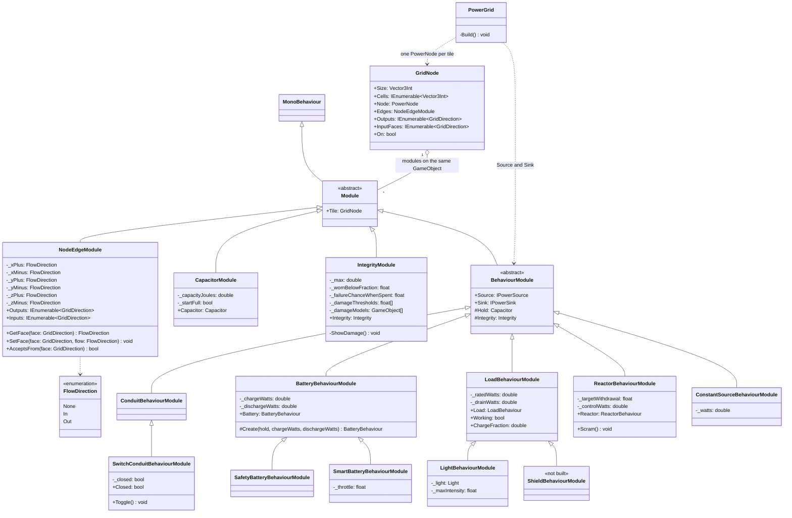

# Modules

**Status: built** (2026-09-26). The sim, the Unity modules, and the scene and prefabs migrated onto
them. Compiles clean and runs in Play mode; not yet uploaded to Somnium.

A conduit and a component are the same kind of thing. Both take power in, hold it, do something
with it, and put power out. What differs is the *something*. So every tile on the grid is a
`GridNode` plus a stack of **modules**. A module is a script you add to the GameObject to give it a
feature or a behaviour.

## The four kinds

| Kind | Concrete | Owns | How many per tile |
|---|---|---|---|
| `NodeEdgeModule` | — | which faces power enters and leaves by | exactly one |
| `CapacitorModule` | — | how much the tile can hold, and how much it holds now | one on every component; none on a conduit |
| `IntegrityModule` | — | condition, wear, misfires, and which model shows the damage | optional |
| `BehaviourModule` | `ConduitBehaviourModule`, `BatteryBehaviourModule`, `ReactorBehaviourModule`, … | what the tile *does* with its hold, and how much it lets go of | exactly one |

**Only the behaviour knows what the tile is.** The edges, the capacitor and integrity know nothing
about batteries or reactors. The behaviour decides how they interact, or whether they interact at all.

A conduit has no `CapacitorModule` because it has nothing to put in one: its hold is the one tick of
flow its edges already carry.

## Examples

What the Inspector shows. Faces not listed are `None`.

```
Conduit                     Switch                      Tee
  GridNode                    GridNode                    GridNode
  NodeEdgeModule              NodeEdgeModule              NodeEdgeModule
    -X In                       -X In                       -X In
    +X Out                      +X Out                      +X Out
  ConduitBehaviourModule      SwitchConduitBehaviour-       -Z Out       <- the whole splitter
  Conduit (visual)              Module                    ConduitBehaviourModule
                              Conduit (visual)            Conduit (visual)

Battery                     Light                       Shield (not built)
  GridNode                    GridNode                    GridNode
  NodeEdgeModule              NodeEdgeModule              NodeEdgeModule
    -X In                       -X In                       -X In
    +X Out
  CapacitorModule             CapacitorModule             CapacitorModule
  SmartBatteryBehaviour-      LightBehaviourModule        IntegrityModule
    Module                                                ShieldBehaviourModule

Reactor
  GridNode (5x5x5)
  NodeEdgeModule
    -X In                   <- starter / control socket
    +Z Out
  CapacitorModule (40 J)    <- the magnets' hold: the core tops it up, the input fills it on a cold start
  ReactorBehaviourModule
```

**A splitter is not a module of its own.** A branch is one more `Out` face, and the share rule does
the rest.

## Class diagram

The Unity layer. Each module holds a plain C# sim object, listed in the table after the diagram.



`#` is protected. `InputFaces` on `GridNode` is where power *actually* arrives, worked out from the
neighbours pointing at the tile; `Inputs` on `NodeEdgeModule` is where it *may*. The cable's shape
is drawn from the first.

### The sim object behind each module

| Module | Sim object (`scripts/Power/`) |
|---|---|
| `CapacitorModule` | `Capacitor` — charge, capacity, `Fill`, `Draw` |
| `IntegrityModule` | `Integrity` |
| `BatteryBehaviourModule` / `Safety…` / `Smart…` | `BatteryBehaviour` / `SafetyBatteryBehaviour` / `SmartBatteryBehaviour`, over the tile's `Capacitor` |
| `LoadBehaviourModule`, `LightBehaviourModule` | `LoadBehaviour`, over the tile's `Capacitor` |
| `ReactorBehaviourModule` | `ReactorBehaviour`, whose magnets are a `LoadBehaviour` over the tile's `Capacitor` |
| `ConstantSourceBehaviourModule` | `ConstantSourceBehaviour` |
| `ConduitBehaviourModule`, `SwitchConduit…` | none — a tile with no source and no sink forwards |

`PowerGraph` only ever sees the sim objects, which is why the tests run outside the Editor.

### What each behaviour does

| Behaviour | Forwards | Offers | Wants |
|---|---|---|---|
| Conduit | **yes** | — | — |
| Switch conduit | yes; open takes the tile off the grid | — | — |
| Battery | no | discharge rate while it has an outlet, and never more than its hold can give this tick | charge rate, while there is room |
| Safety / Smart | no | as battery, released only toward a component / only while something asks, × throttle | as battery |
| Load | no | — | draw rate until full; works from full to empty, misfires if worn |
| Reactor | no | what the core made, less what the magnets still needed | whatever the magnets need that the core cannot cover |

**The reactor's hold is its magnets' hold.** The core tops it up before a watt reaches the output
(house load), and the input fills it only when the core cannot, which is a cold start. Grid power
never leaves by the output. The dial (`TargetWithdrawal`) belongs to the crew: while the magnets
grip, the rods head for it; without grip they fall; when grip comes back they head for it again.
See `reactor.md`.

## One tick

1. **Offer.** Each tile's source says what it puts out (`WattsOffered(node, seconds)`). The graph
   splits that across the live output edges by `Share`. With no live edge, nothing leaves.
2. **Travel.** One tile per tick.
3. **Accept.** Each tile's sink takes up to its `WattsWanted` of what arrived. A conduit carries the
   rest on; **a component does not, and what it did not take is dumped there, as heat.**
4. **Behave.** Sources advance (`ProvidePower`), sinks bank what they got (`Receive`).
5. **Heat, conduction, pop rolls, then rings.**

Power only ever moves between holds or is counted as waste, so it conserves by construction
(principle 11).

**A component never passes power through.** Only a tile with no source and no sink forwards, so only
conduits are links in the chain:

```
R-c-c-c        the shield has no output. Not a loop, never was.
      |
      S

R-C-C-B-C      the reactor and the battery each break it. Not a loop.
|       |
C-C-C-C-C

A1 -> A2 -> B1 -> B2 -> A1      every tile forwards. A ring.
```

**A ring blows its merge point instantly.** A ring is a cycle made only of forwarding tiles. Its
merge point is the tile on the ring fed from outside it (A1 above). The check runs every tick over
the live conduits (one walk over a few dozen tiles), so a switch that closes a ring is caught the
tick it closes. On the first tick power reaches the merge point, it is severed, and loses all its
integrity if it has any.

## Faces

Every face of a tile is `In`, `Out` or `None`, set with `SetFace` and read with `GetFace`. A face is
never both. They are six named fields (`_xPlus` … `_zMinus`) so the Inspector shows each face by
name, and plain enums survive the Somnium bundle export where an array of custom classes arrives
empty. A new `NodeEdgeModule` starts with every face `In`.

A tile takes power only on a face set to `In`, so a conduit that accepts from anywhere has `In` on
every face that is not an `Out`. Faces are **world directions** for now; making them turn with the
tile is part of live rewiring, below.

## Conduit variants — pinned until after the first static upload

**Superseded (2026-09-26)** by the hologram design in `todolist.md` → *Live wiring*: a switch or a
junction is now an **addon** installed into an open conduit, which reshapes it, rather than a part
placed on top of it. Splitters and mergers are gone in favour of Junction +1 to +4. The rest of this
section is what the scene still does today.

Switches and splitters are going to be parts a player **places on top of a conduit**. The model fits
seamlessly into the cable, and the part **takes over that conduit's behaviour**. How that works
while the ship is running comes after something static has been uploaded to Somnium.

Until then, the scene bakes them in. The switch is a `SwitchConduitBehaviourModule` on the conduit
tile itself, and the splitter is an extra `Out` face on that tile's `NodeEdgeModule`. The
`SwitchModule` and `SplitterModule` prefabs survive only as script-less markers that show where
they are. Their names predate "module" meaning what it does now.

## Rewiring live — after the MVP

**Not part of the MVP.** The MVP is the current scene in VR, with its wiring fixed and its parts
interactable. Changing the wiring by hand comes after that. This section records what that step
will need.

The crew physically reconfigures the ship, so the wiring cannot be something built once in
`PowerGrid.Awake`, which is all it is today. Three things have to change.

**Faces are local to the tile.** Today a `GridDirection` is a world axis, and rotating a tile does
not rotate its flow. `NodeEdgeModule` stores faces in the tile's own frame and turns them into world
faces through its rotation, so turning a battery round turns its output with it.

**A tile says when it has changed.** `NodeEdgeModule` raises `Changed` when:
- a face is changed (Inspector or `SetFace`)
- the tile moves or turns (`transform.hasChanged`, checked in `LateUpdate`)
- the tile is enabled, disabled or destroyed

It runs in edit mode as well, so the stubs and the gizmos follow along as you build, which is what
`Conduit` being `[ExecuteAlways]` already does for the look.

**The grid rewires one tile, not the ship.** On `Changed`, `PowerGrid.Rewire(tile)` drops every edge
into and out of that tile and reconnects it from its current faces, against its current neighbours
and its old ones, since a tile moving away changes theirs too. Then the ring check runs. That needs
two things `PowerGraph` does not have: `Disconnect(edge)` and `RemoveNode(node)`. Heat, charge and
integrity belong to the tile, not to its edges, so they survive a rewire.

An edge carries one tick's flow at most, so dropping one mid-flight loses at most one tick of power.
It is counted as waste on the sending tile, so the books still balance.

## What changed from the old model

- **A component never passes power through.** A full battery mid-run dumps what arrives as heat on
  itself, and everything downstream of a battery gets at most its discharge rate: a real UPS.
- **A battery cannot offer more than it holds.** It used to offer its full rating whenever it had any
  charge at all, and the grid handed that out before the battery found it could not pay, so a
  nearly empty cell on a trickle put out its full rating from nothing. Found in Play mode on
  2026-09-26; `WattsOffered` now takes the tick's length.
- **The reactor's dial is the crew's.** It used to zero itself when the magnets lost grip, which also
  made a cold start impossible, since the magnets have no grip on the first tick.
- **A ring of conduits blows its merge point.** It used to compound quietly on every lap.
- `PowerNode.PassesThrough` is gone; `Validate()` reports rings instead of every cycle.

Everything else came through with the same numbers. The harness went from 224 to 242 checks, with
the old expectations changed only where one of the rules above says they should.

## Renames

| Was | Is |
|---|---|
| `ConduitModule` (abstract, switch + splitter) | gone |
| `SplitterModule` | one more `Out` face on `NodeEdgeModule` |
| `SwitchModule` | `SwitchConduitBehaviourModule` |
| `BatteryModule` + `CellTier` | `CapacitorModule` + `BatteryBehaviourModule` / `Safety…` / `Smart…` |
| `LightModule`, `AccumulatorModule` | `CapacitorModule` + `LightBehaviourModule` / `LoadBehaviourModule` |
| `ReactorModule` | `CapacitorModule` + `ReactorBehaviourModule` |
| `ConstantSourceModule` | `ConstantSourceBehaviourModule` |
| `GridNode._outputs` / `_inputs` | `NodeEdgeModule`'s six faces |
| `EnergyStore`, `SafetyStore`, `SmartStore` | `BatteryBehaviour`, `SafetyBatteryBehaviour`, `SmartBatteryBehaviour` |
| `Accumulator` | `LoadBehaviour` |
| `Reactor` | `ReactorBehaviour` |
| `ConstantSource` | `ConstantSourceBehaviour` |
| `Durability` | `Integrity` |
| `Conduit` | unchanged; it is the cable's look, not a module |

The scene and prefabs were migrated in the Editor: every old component's serialized fields were
snapshotted to JSON while the old scripts were still loaded, then applied to the new modules and
checked back tile by tile.

## Damage models are two plain arrays

`IntegrityModule`'s damage list is `float[] _damageThresholds` beside `GameObject[] _damageModels`,
same length, not an array of pairs. Arrays of custom `[Serializable]` classes arrive **empty** from a
Somnium bundle export while plain arrays survive (Project Garden lost uploads to this before it was
understood). Below each threshold its model is shown and the rest are hidden.
